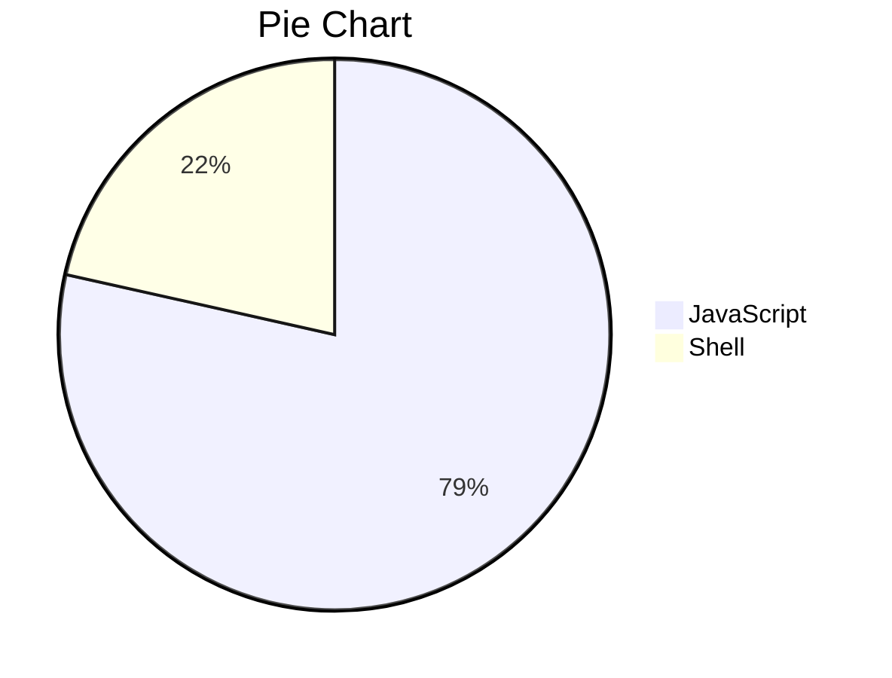

# FIRESTREAM - Adaptive Video Streaming Service

FIRESTREAM - https://firestreamz.co/

Frontend: https://github.com/abhishekraj272/Video-Streaming-Frontend  
Backend: https://github.com/abhishekraj272/Video-Streaming-Backend

## Languages

### Tech Used

- ExpressJS - For APIs
- MongoDB - For Fast R/W as little to no relation between data's + plus comes with free tier.
- Bash - For writting script to automate video video processing
- ffmpeg - For breaking video in chunks

### Video Processing
- DASH Protocol is used to break videos in chunks of 7 seconds.
- DASH JS is used to fetch and play videos from AWS S3.

### How to Use ?
[![watch the video]]
[(https://drive.google.com/file/d/127z_a7Ud9HAK15mpNRTf5dAJ3DxhUf5U/view?usp=sharing)]

### User friendly 

### Log-in page 

### Simple guided Video Upload page 

- Note:- Log-In warning will show , if you are not logged in.

### License 
MIT